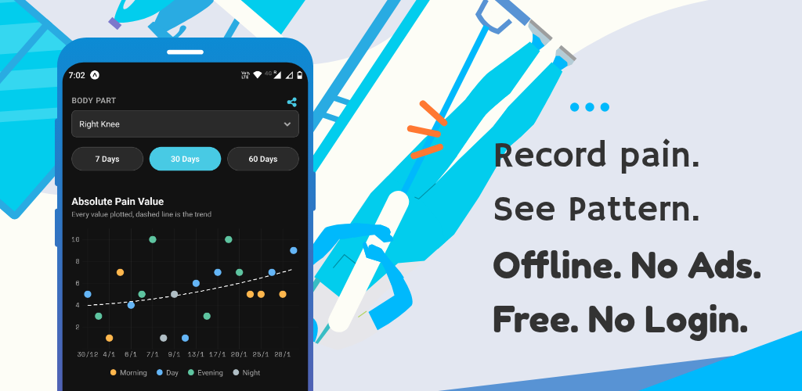

# Pain Recorder

Chronic pain steals joy.
Understanding your pain—its location, pattern, and intensity—can help you and your care provider make better decisions about treatment and life planning.

**Free. No ads. No login. Your data stays on your device.**

---

## Why I Built This

I built Pain Recorder for my own pain tracking.
It is intentionally simple and focused—nothing more than a tool to help anyone who wants to track their pain clearly and privately.

---

## Features

### Flexible Body Parts
- Start with a default list of body parts
- Delete body parts you don’t need
- Add custom body parts if something is missing
- Restore the default list at any time

The most recently recorded body part always stays at the top for quick access.

---

### Simple, Honest Data
- Record pain levels by body part
- Multiple entries per day supported
- Clear your data anytime, no questions asked

**Your data never leaves your device.**
No servers. No syncing. No tracking. No AI.
I don’t want your data, and I don’t collect it.

---

### Data & Analytics
- View raw data in reverse chronological order
- Color-coded rows for easy scanning
- Export all data as CSV if you want to do your own analysis

---

### Statistics & Insights
The Stats screen includes:
- Average pain level per body part
- Scatter chart with trend line for selected time periods
- Pain frequency by time of day (morning, day, evening, night)
- Heat map to visualize good days and bad days
- Color-coded raw data for a selected body part

You can export the full analysis as an image—
to share with your care provider, or as a perfectly valid excuse to skip a boring office party 🙂

---

**Pain Recorder**
Simple. Private. Offline.
